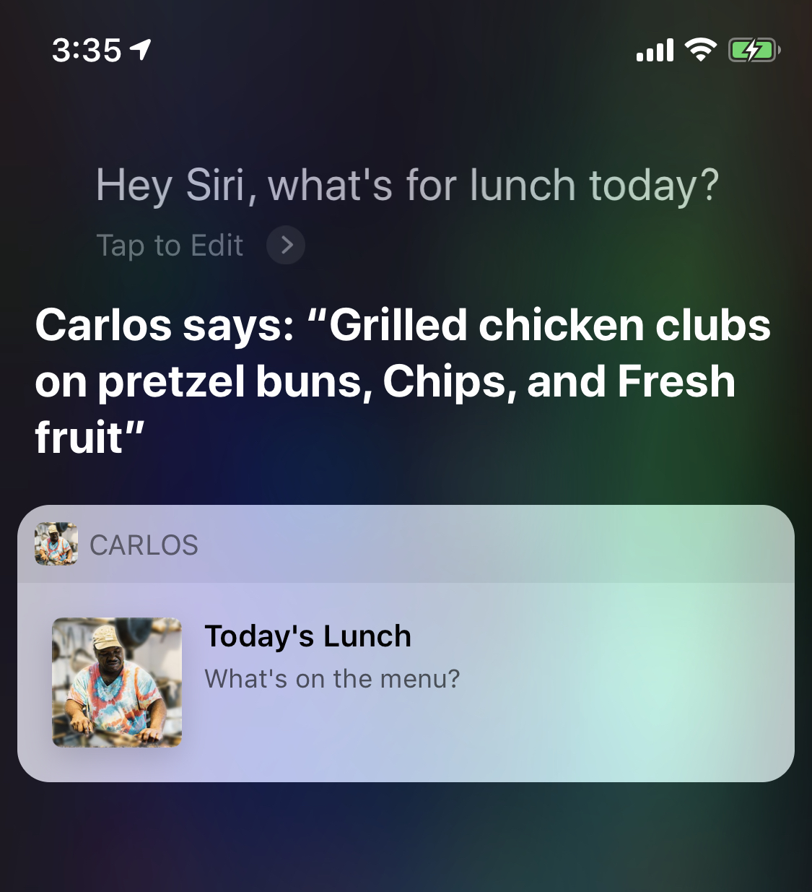

## Siri Menu

This is a proof-of-concept iOS app that lets you ask Siri questions like *"What's for lunch today?"* or *"What's for dinner on Wednesday?"*. 

It imports, parses, and saves data from a [`menu.docx`](https://github.com/calda/Siri-Menu/blob/master/Siri%20Menu/Sample%20Menu.docx) to be quried against throughout the week. You can add any variant of *"What's for %meal on %day?"* to Siri using the Shortcuts API.

  
  
